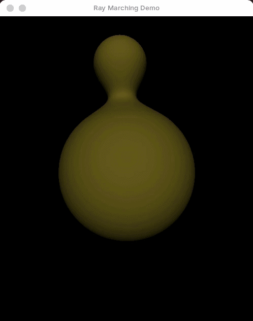

# Ray Marching - PolyHok Demo

A 3D scene rendered in real time using the [ray marching](https://en.wikipedia.org/wiki/Ray_marching) technique, showcasing the capabilities of the [PolyHok DSL](https://github.com/lups-ufpel/poly_hok) integrated seamlessly with the Elixir actors model for concurrency.

For a more detailed breakdown of how this demo works, please, visit the [PolyHok Website](https://lups.inf.ufpel.edu.br/polyhok/doku.php?id=programs:raymarching).

<p align="center">
  
</p>

## Prerequisites

* **PolyHok DSL**. Take a look at the [PolyHok Installation Guide](https://lups.inf.ufpel.edu.br/polyhok/doku.php?id=polyhok-install) for more information on how to install and use PolyHok in your system.
* **SDL2 Development Libraries** (required by the [SimpleSDL2](https://github.com/lups-ufpel/simple_sdl_for_elixir) Elixir library):
  * Ubuntu / Debian: `sudo apt-get install libsdl2-dev`
  * Arch Linux: `sudo pacman -S sdl2`
  * macOS: `brew install sdl2`

## Getting Started

1. **Clone the repository**:

   ```bash
   git clone https://github.com/lups-ufpel/poly_hok_raymarching_demo.git
   cd poly_hok_raymarching_demo
   ```

2. Install dependencies and compile:
  
   ```bash
   mix deps.get
   mix compile
   ```

3. Run the demo:

   ```bash
   # Run demo at default FPS (60 FPS)
   mix run scripts/ray_marching_demo.exs

   # Custom FPS (e.g., 30 FPS)
   mix run scripts/ray_marching_demo.exs 30
   ```

    To exit, close the window or press ESC. The code will detect the window termination and cleanly terminate the GPU worker loop.

## License

This project is licensed under the MIT License. See the [LICENSE](LICENSE) file for details.
